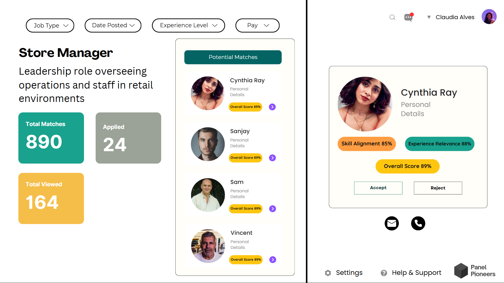

# Introduction Panel Pioneer

Panel Pioneer is an innovative platform designed to streamline the job application process by leveraging cutting-edge technology. It bridges the gap between job seekers and employers, providing a more efficient and personalized experience.

## Features

- BERT-powered resume analysis
- Intelligent job matching
- Automated interview scheduling
- Integration with major job portals

## Technology Stack

- Backend: Python, Flask
- Frontend: React.js
- Machine Learning: BERT (TensorFlow)
- APIs: LinkedIn, Glassdoor, Indeed, Outlook

## Getting Started

1. Clone the repository
2. Install dependencies: `pip install -r requirements.txt`
3. Set up environment variables (see `.env.example`)
4. Run the backend: `python src/backend/api/routes.py`
5. Run the frontend: `cd src/frontend && npm start`

6. ## User Interface


### Homepage 


### Dashboard



### Interview TimeSlot Booking


### Candidate Final Landing Page


### Recruiter Finding Interview Panel


### Recruiter Final Landing Page


## Documentation

For more detailed information, please refer to the [docs](./docs) directory.

## Outlook API Integration

This project uses the Outlook API for calendar integration. To set up your own credentials:

1. Go to the [Azure Portal](https://portal.azure.com/)
2. Navigate to "App registrations" and create a new registration
3. Set up the following API permissions:
   - Microsoft Graph > Calendars.Read
   - Microsoft Graph > Calendars.ReadWrite
4. Generate a new client secret

Then, update the following environment variables:

```shell
export OUTLOOK_CLIENT_ID=8f3a2b5c-9d1e-4f6a-8g7h-2i3j4k5l6m7n
export OUTLOOK_CLIENT_SECRET=bYt8xCz7dW6eV5fU4gT3hR2jQ1kP0mN9oL8iK7jH6gF5dS4aA3
